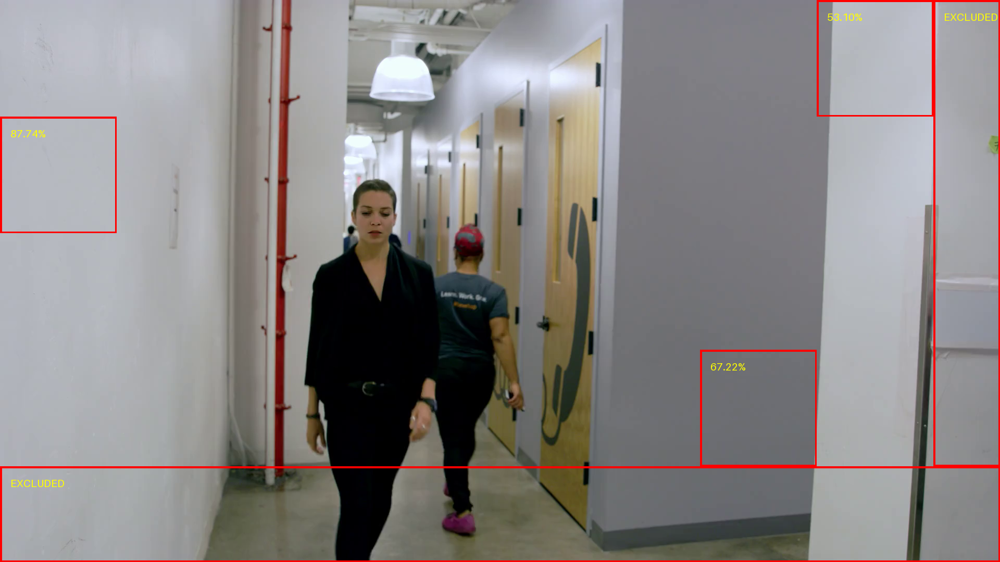
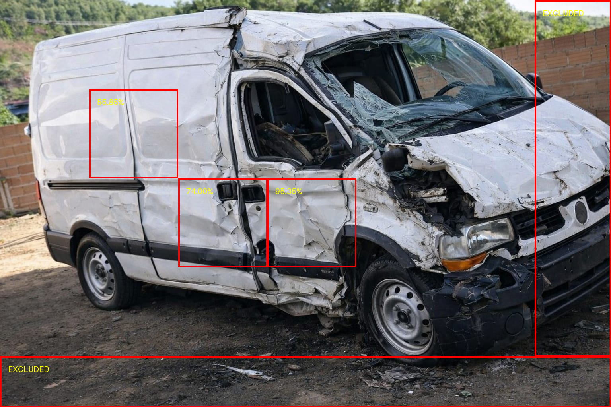

# Extensão Forense — Universal Fake Detect (UFD)

**Exemplo de uso:**
```bash
python image_score.py --img caminho/para/imagem.jpg --out imagem_saida.png
```

## Setup
Recomenda-se instalar o miniconda para melhor controle de versões e compatibilidade de bibliotecas e recursos.
Após instalação do miniconda:

```bash
git clone https://github.com/raphaelnapi/UniversalFakeDetect_Forensic/
conda create -n ufd python=3.10 -y
conda activate ufd
```

Em caso de GPU:
```bash
conda install pytorch torchvision torchaudio pytorch-cuda=11.8 -c pytorch -c nvidia -y
```

Em caso de somente CPU:
```bash
conda install pytorch torchvision torchaudio cpuonly -c pytorch -y
```

Dependências no PyPI:
```bash
pip install -r requirements.txt
```

## Escopo e Finalidade

Este repositório é um **fork** do projeto original **Universal Fake Detect (UFD)**.
O código-fonte original e o arquivo `README_UFD.md` descrevem um uso **acadêmico e orientado a benchmarks**,
voltado à avaliação de desempenho de modelos de detecção de imagens sintéticas em conjuntos de dados.

Este documento descreve **script adicional com finalidade forense**, incluído neste fork (image_score.py),
destinado especificamente à **análise de imagem única** em contextos de **perícia digital** com o objetivo
de **estimar a probabilidade** de uma imagem ter sido **gerada por IA**.

> **Importante:**  
> Os scripts forenses aqui descritos realizam **inferência probabilística**.
> Os resultados **não constituem prova conclusiva**, quando considerados de forma isolada.

---

## Objetivo Forense

A extensão forense tem como objetivo:

- Aplicar um **modelo de aprendizado de máquina fixo e bem definido** a uma **imagem individual**
- Produzir um **score numérico** e uma **estimativa probabilística**
- Subsidiar **laudos, pareceres técnicos e análises periciais**
- Preservar **clareza metodológica, reprodutibilidade e auditabilidade**

Esta extensão **não se destina** a:
- validação estatística de modelos
- treinamento ou *fine-tuning*
- comparação de desempenho entre arquiteturas

---

## Visão Metodológica

### Modelo Utilizado
- **Backbone:** CLIP ViT-L/14 (*frozen*)
- **Classificador:** Modelo pré-treinado do Universal Fake Detect (UFD)
- **Tipo de processamento:** Inferência probabilística em imagem única

---

## Script Forense

### `image_score.py`

Script forense para **inferência em imagem única**.

**Funcionalidades:**
- Carrega o modelo UFD/CLIP ViT-L/14 pré-treinado
- Aplica pré-processamento padronizado à imagem
- Calcula um score escalar no intervalo `[0, 1]`
- Apresenta o resultado como **probabilidade estimada de geração por IA** de cada patch 224x224 pixels da imagem

## Exemplo de Saída

### Imagens de Saída



### Log de Saída (ufd_forensics.log)
```text
2026-02-05 02:53:22,483 | INFO | :: Start processing image: imagens\van3.jpg
2026-02-05 02:53:22,483 | INFO | :: OPTIONS
2026-02-05 02:53:22,483 | INFO | --IMG: imagens\van3.jpg
2026-02-05 02:53:22,483 | INFO | --ARCH: CLIP:ViT-L/14
2026-02-05 02:53:22,483 | INFO | --CKPT: ./pretrained_weights/fc_weights.pth
2026-02-05 02:53:22,483 | INFO | --THRES: 50
2026-02-05 02:53:22,483 | INFO | --OUT: van3.png
2026-02-05 02:53:25,943 | INFO | :: Model loaded
2026-02-05 02:53:26,594 | INFO | :: Image preprocessed
2026-02-05 02:53:26,992 | INFO | :: Patch (224, 224, 448, 448)
2026-02-05 02:53:26,992 | INFO | Score (Model CLIP:ViT-L/14): 0.5584520101547241
2026-02-05 02:53:26,992 | INFO | Estimated AI Generation Probability: 55.85%
2026-02-05 02:53:27,232 | INFO | :: Patch (448, 448, 672, 672)
2026-02-05 02:53:27,232 | INFO | Score (Model CLIP:ViT-L/14): 0.7399860620498657
2026-02-05 02:53:27,232 | INFO | Estimated AI Generation Probability: 74.00%
2026-02-05 02:53:27,422 | INFO | :: Patch (672, 448, 896, 672)
2026-02-05 02:53:27,422 | INFO | Score (Model CLIP:ViT-L/14): 0.9535248279571533
2026-02-05 02:53:27,422 | INFO | Estimated AI Generation Probability: 95.35%
```

```text
2026-02-05 02:32:49,991 | INFO | :: Start processing image: imagens\frame.png
2026-02-05 02:32:49,991 | INFO | :: OPTIONS
2026-02-05 02:32:49,991 | INFO | --IMG: imagens\frame.png
2026-02-05 02:32:49,991 | INFO | --ARCH: CLIP:ViT-L/14
2026-02-05 02:32:49,991 | INFO | --CKPT: ./pretrained_weights/fc_weights.pth
2026-02-05 02:32:49,991 | INFO | --THRES: 50
2026-02-05 02:32:49,991 | INFO | --OUT: frame_processed.png
2026-02-05 02:36:39,565 | INFO | :: OPTIONS
2026-02-05 02:36:39,565 | INFO | --IMG: imagens\frame.png
2026-02-05 02:36:39,565 | INFO | --ARCH: CLIP:ViT-L/14
2026-02-05 02:36:39,565 | INFO | --CKPT: ./pretrained_weights/fc_weights.pth
2026-02-05 02:36:39,565 | INFO | --THRES: 50
2026-02-05 02:36:39,566 | INFO | --OUT: frame_processed.png
2026-02-05 02:36:43,796 | INFO | :: Patch (0, 224, 224, 448)
2026-02-05 02:36:43,797 | INFO | Score (Model CLIP:ViT-L/14): 0.8773556351661682
2026-02-05 02:36:43,797 | INFO | Estimated AI Generation Probability: 87.74%
2026-02-05 02:36:45,063 | INFO | :: Patch (1344, 672, 1568, 896)
2026-02-05 02:36:45,063 | INFO | Score (Model CLIP:ViT-L/14): 0.6722385883331299
2026-02-05 02:36:45,063 | INFO | Estimated AI Generation Probability: 67.22%
2026-02-05 02:36:45,112 | INFO | :: Patch (1568, 0, 1792, 224)
2026-02-05 02:36:45,112 | INFO | Score (Model CLIP:ViT-L/14): 0.5310311913490295
2026-02-05 02:36:45,112 | INFO | Estimated AI Generation Probability: 53.10%
```
